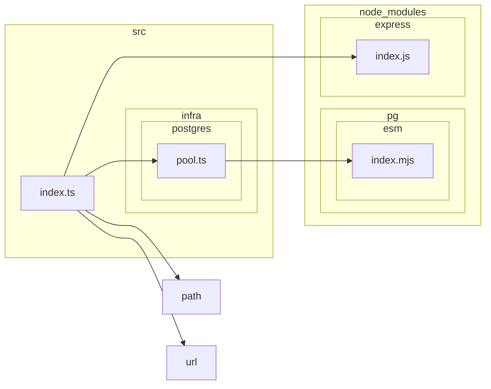

```mermaid
flowchart LR

subgraph 0["src"]
1["index.ts"]
subgraph 7["infra"]
subgraph 8["postgres"]
9["pool.ts"]
end
end
end
subgraph 2["node_modules"]
subgraph 3["express"]
4["index.js"]
end
subgraph A["pg"]
subgraph B["esm"]
C["index.mjs"]
end
end
end
5["path"]
6["url"]
1-->9
1-->4
1-->5
1-->6
9-->C
```
